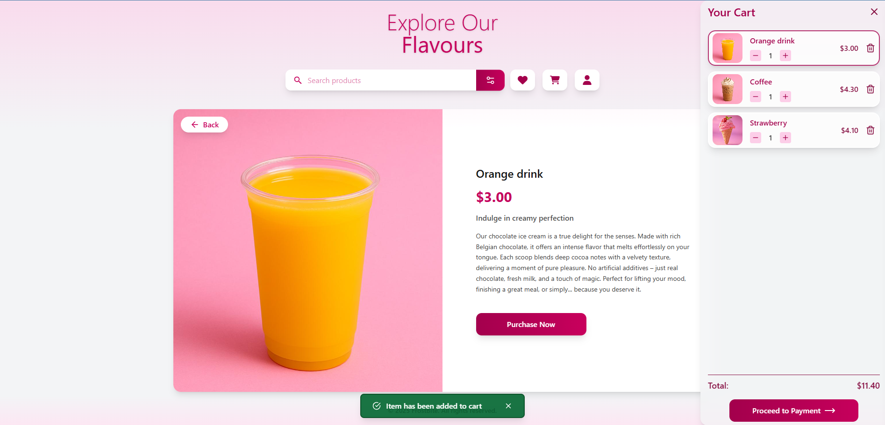
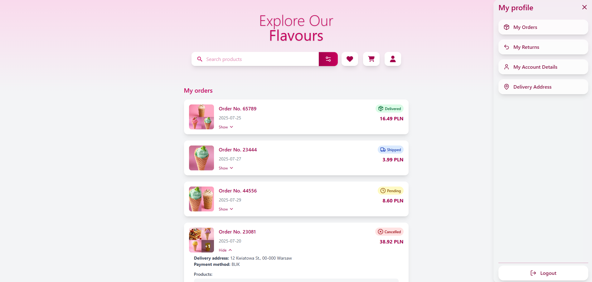

# 🚀 Live Demo

Check out the live version of this project here:  [LIVE FrostBite](https://milakropeczka.github.io/FrostBite/)

# 🖼 Image Gallery – React + TypeScript Project






## 🎯 Project Goal

This is a simple front-end online store built to showcase key front-end skills, including:
- building dynamic interfaces with React,  
- managing application state (Zustand, Context),  
- working with REST APIs (via React Query),  
- handling cart logic with localStorage persistence,  
- filtering products and implementing a responsive layout. 

## ⚙️ Technologies

- **React**
- **TypeScript**
- **Vite**
- **Zustand** – global cart state management  
- **React Query** – API data fetching and caching
- **Mock Service Worker (MSW)** – API mocking during development and testing
- **Context API** – used for product filtering  
- **ESLint + Prettier** – code formatting and quality  
- **HTML, CSS, Tailwind** – custom styles  
- **localStorage** – persistent cart between sessions
- **Zod** – schema validation and type-safe form handling
- **React Hook Form** – performant form state management with Zod integration  

## ✨ Features

- 🧾 Add/remove products from the cart  
- 💾 Cart saved to localStorage  
- 📦 Product list fetched from a REST API  
- 🔍 Filter products by category  
- 👁️ View product details on a separate page  
- 🔎 Search products by name  
- 📱 Fully responsive design  
- ✅ Clean, modular code with ESLint + Prettier
- ⏳ Loading states handled with skeleton placeholders for better UX
- ⚠️ Error states handled with user-friendly error messages

## 🚧 Work in progress
- ProfileDrawer (UI only, functionality coming soon)

## 🛠️ Planned:
- Add backend integration
- Implement user registration  
- Add settings options to the search functionality  
- Enable adding product reviews

## 📂 Code Structure

- Components split into logical modules (`Cart`, `ProductList`, `Search`, `ProductDetails`)
- State management split into global (`Zustand`, `Context`) and local (`useState`)
- Typed hooks and components with TypeScript
- Clean class organization and styling with plain CSS

## 📬 Get in touch!

Questions, feedback, or collaboration? Reach me at:

- Email: milakropeczka@gmail.com  
- LinkedIn: [linkedin.com/in/paulina-gruszka](https://linkedin.com/in/paulina-gruszka-414931b5)
- GitHub: [github.com/milakropeczka](https://github.com/milakropeczka)

## 📦 Installation
    git clone https://github.com/MilaKropeczka/FrostBite.git
    npm install
    npm run dev
  
---

## 🛠 Advanced setup 

# React + TypeScript + Vite

This template provides a minimal setup to get React working in Vite with HMR and some ESLint rules.

Currently, two official plugins are available:

- [@vitejs/plugin-react](https://github.com/vitejs/vite-plugin-react/blob/main/packages/plugin-react/README.md) uses [Babel](https://babeljs.io/) for Fast Refresh
- [@vitejs/plugin-react-swc](https://github.com/vitejs/vite-plugin-react-swc) uses [SWC](https://swc.rs/) for Fast Refresh

## Expanding the ESLint configuration

If you are developing a production application, we recommend updating the configuration to enable type-aware lint rules:

```js
export default tseslint.config({
  extends: [
    // Remove ...tseslint.configs.recommended and replace with this
    ...tseslint.configs.recommendedTypeChecked,
    // Alternatively, use this for stricter rules
    ...tseslint.configs.strictTypeChecked,
    // Optionally, add this for stylistic rules
    ...tseslint.configs.stylisticTypeChecked,
  ],
  languageOptions: {
    // other options...
    parserOptions: {
      project: ['./tsconfig.node.json', './tsconfig.app.json'],
      tsconfigRootDir: import.meta.dirname,
    },
  },
})
```

You can also install [eslint-plugin-react-x](https://github.com/Rel1cx/eslint-react/tree/main/packages/plugins/eslint-plugin-react-x) and [eslint-plugin-react-dom](https://github.com/Rel1cx/eslint-react/tree/main/packages/plugins/eslint-plugin-react-dom) for React-specific lint rules:

```js
// eslint.config.js
import reactX from 'eslint-plugin-react-x'
import reactDom from 'eslint-plugin-react-dom'

export default tseslint.config({
  plugins: {
    // Add the react-x and react-dom plugins
    'react-x': reactX,
    'react-dom': reactDom,
  },
  rules: {
    // other rules...
    // Enable its recommended typescript rules
    ...reactX.configs['recommended-typescript'].rules,
    ...reactDom.configs.recommended.rules,
  },
})
```
